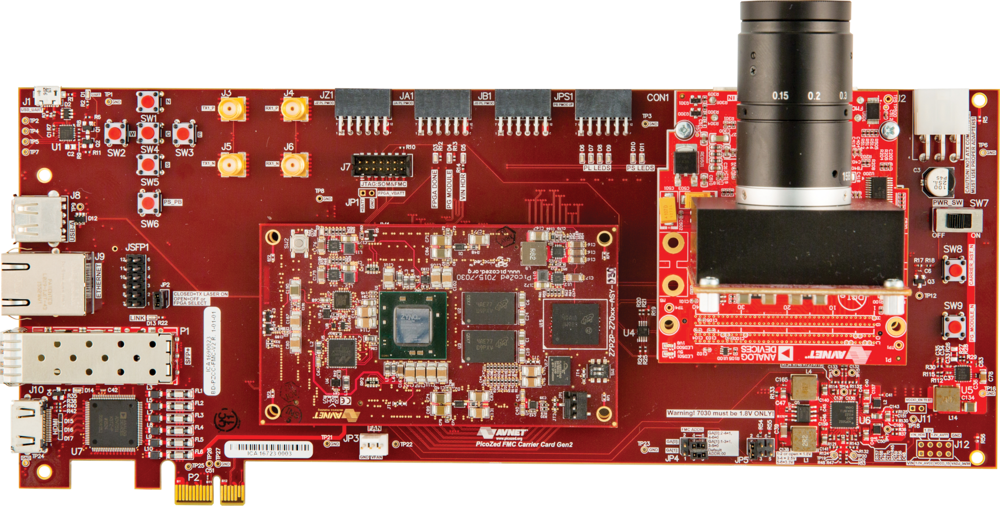
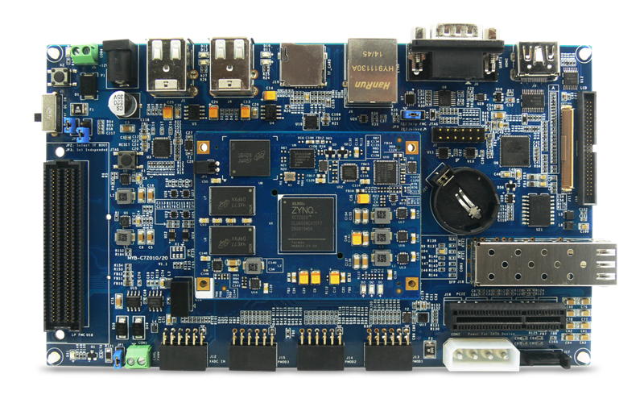
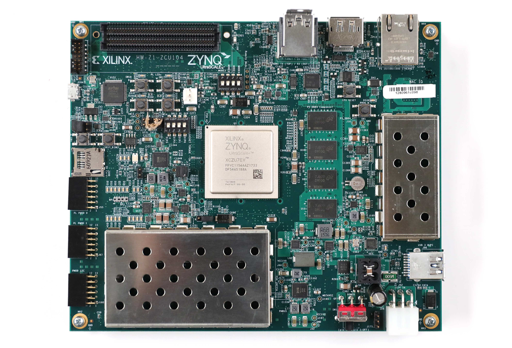
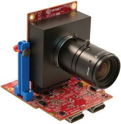
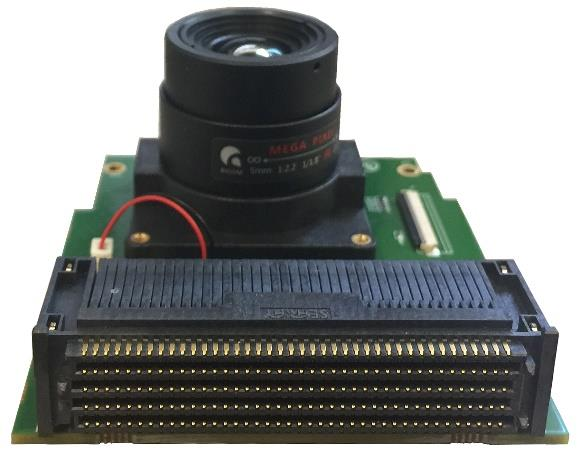
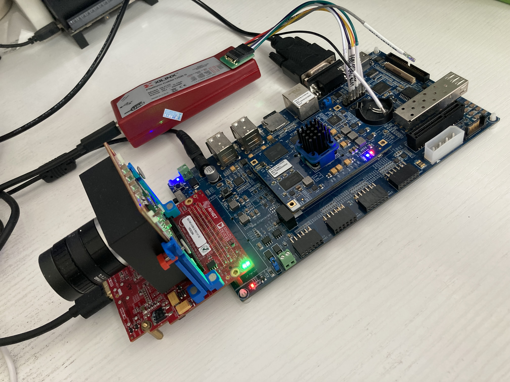

# FPGA Embedded Vision
## Boards
* [Picozed Zynq 7030 som + FMC carrier v2](http://zedboard.org/product/picozed-fmc-carrier-card-v2)

* [MYIR 7020 board](http://www.myir-tech.com/product/myd_C7Z010_20.htm)

* [Xilinx ZCU104 board](https://www.xilinx.com/products/boards-and-kits/zcu104.html)

## Camera Modules
* [AES-CAM-ON-P1300C-G](https://www.avnet.com/shop/us/products/avnet-engineering-services/aes-cam-on-p1300c-g-3074457345635221618/) + [AES-FMC-HDMI-CAM-G](https://www.avnet.com/shop/us/products/avnet-engineering-services/aes-fmc-hdmi-cam-g-3074457345635221625/)

* [LI-IMX274-FMC](https://leopardimaging.com/product/csi-2-mipi-modules-i-pex/li-imx274mipi-fmc/)

## Software Environment
* Vivado/SDx 2019.1/2018.3
## Reference Designs
1. [Avnet Reference Design](https://github.com/Avnet/hdl) [Picozed Zynq  7030 SOM + Onsemi PYTHON1300 FMC + Picozed FMC carrier board v2]
2. [ZCU106 VCU TRD 2019.1](https://xilinx-wiki.atlassian.net/wiki/spaces/A/pages/112230447/Zynq+UltraScale+MPSoC+VCU+TRD+2019.1)
3. [Xilinx reVision](https://github.com/Xilinx/reVISION-Getting-Started-Guide)
## Create HW & SW Projects
1. Onsemi PYTHON1300 FMC card + ZCU104

   This project is porting from Avnet Hdl project, from Picozed Zynq7030 to ZCU104.
```shell
cd scripts
vivado -mode tcl -source zcu104_fmchc_python1300c.tcl -notrace
```
2. LI-IMX274-FMC + ZCU104

    This project is porting from ZCU106 VCU TRD reference design.
```shell
cd scripts
vivado -mode tcl -source zcu104_vcu_trd_proj.tcl -notrace
```
3. Onsemi PYTHON1300 FMC card + myir7020

   This project is now updated to **2021.2**.
   - combined color space convert and chroma subsampling into single Video Processing Subsystem IP;
   - replace OSD with Video Mixer IP;
   - add one more test pattern generated base layer.

```shell
cd myir
vivado -mode tcl -source myir7020_fmchc_python1300c.tcl -notrace
```

