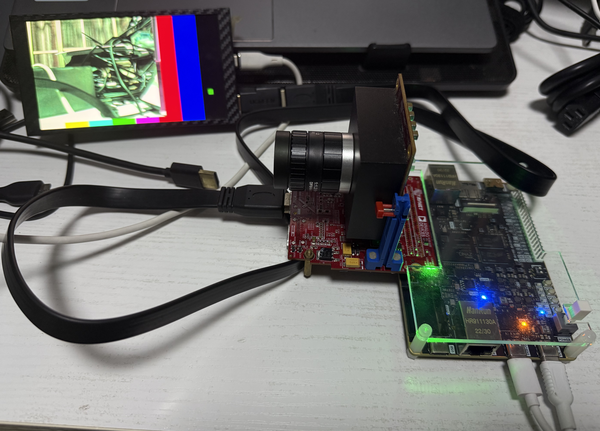
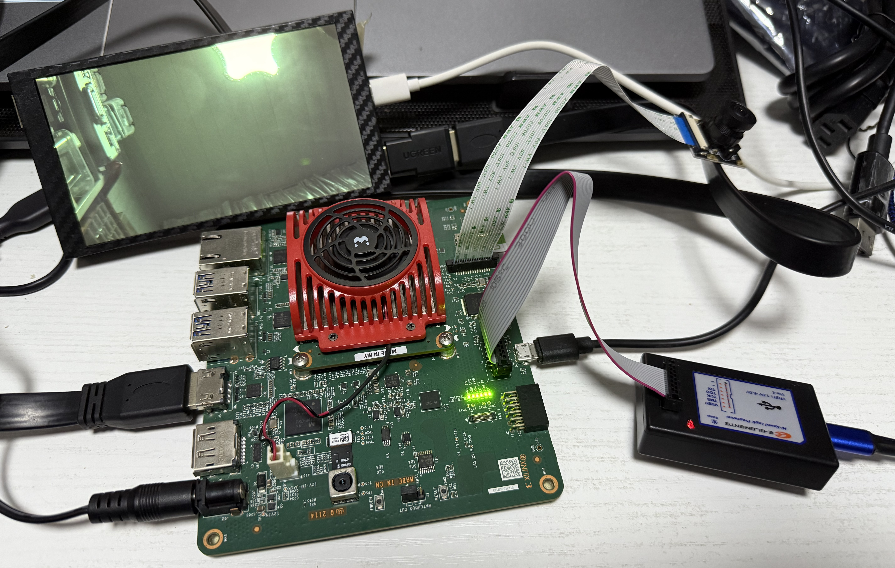
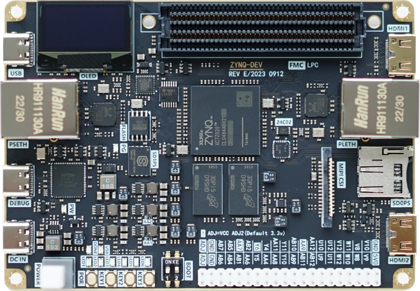
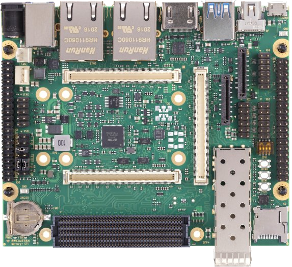
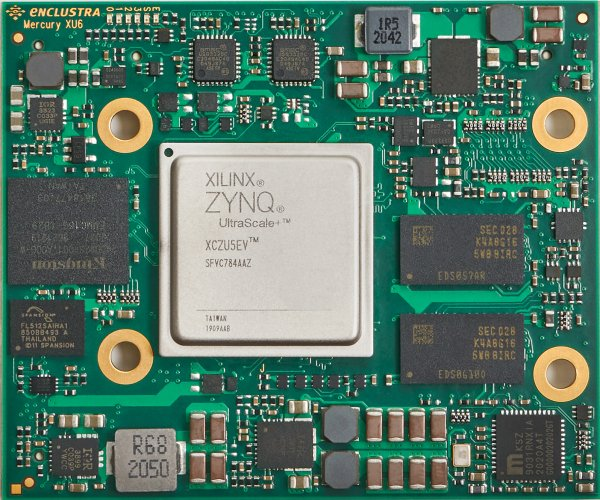
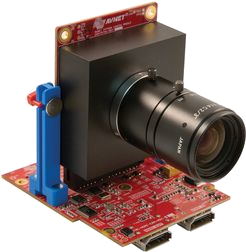

# FPGA Embedded Vision

## Software Environment

* Host PC: Ubuntu 25.04 dev branch
* Vivado 2024.2
* Vitis 2024.2

## Reference Designs

1. [Avnet Reference Design](https://github.com/Avnet/hdl) [Picozed Zynq  7030 SOM + Onsemi PYTHON1300 FMC + Picozed FMC carrier board v2]
2. [ZCU106 VCU TRD 2019.1](https://xilinx-wiki.atlassian.net/wiki/spaces/A/pages/112230447/Zynq+UltraScale+MPSoC+VCU+TRD+2019.1)
3. [Xilinx reVision](https://github.com/Xilinx/reVISION-Getting-Started-Guide)
4. [https://github.com/gtaylormb/ultra96v2_imx219_to_displayport](https://github.com/gtaylormb/ultra96v2_imx219_to_displayport)

## Create HW & SW Projects

1. Onsemi PYTHON1300 FMC + ZCU104(under developing)

   This project is porting from Avnet Hdl project, from Picozed Zynq7030 to ZCU104.

```shell
cd scripts
vivado -mode tcl -source zcu104_fmchc_python1300c.tcl -notrace
```

2. LI-IMX274-FMC + ZCU104

    This project is porting from ZCU106 VCU TRD reference design.
    updated to 2024.2

```shell
cd scripts
vivado -mode tcl -source zcu104_vcu_trd_proj.tcl -notrace
```

3. Onsemi PYTHON1300 FMC + MYD-C7Z020

   This project is now updated to **2024.2**.
   * combined color space convert and chroma subsampling into single Video Processing Subsystem IP;
   * replace OSD with Video Mixer IP;
   * add one more test pattern generated base layer.

```shell
source $(VITIS_PATH)/settings64.sh
make myir
```

<p align="center">

</p>

4. Onsemi PYTHON1300 FMC + ZYNQ_DEV

   This project is now updated to **2024.2**.
   * combined color space convert and chroma subsampling into single Video Processing Subsystem IP;
   * replace OSD with Video Mixer IP;
   * add one more test pattern generated base layer.

```shell
source $(VITIS_PATH)/settings64.sh
make zynqdev_fmchc_python1300c
```

<p align="center">

</p>

5. IMX219 RaspberryPi 15pin MIPI camera module + KV260
   Copied for Greg Taylor's project, and update to **2024.2**.

```shell
source $(VITIS_PATH)/settings64.sh
make kv260_rpi_mipi
```

Since KV260 fw bootloader is not compatible with standalone BOOT.BIN. So we need a Jtag to run the demo. Need to set KV260 to jtag boot mode:

```shell
source $(VITIS_PATH)/settings64.sh
xsct scripts/som_bootmode.tcl
```

after that use Vitis to open the sw workspace and run the demo.

<p align="center">

</p>

6. IMX219 RaspberryPi 15pin MIPI camera module + Mercury+ ST1 + XU6

```shell
source $(VITIS_PATH)/settings64.sh
make me_xu6_st1_mipi
```

<p align="center">

</p>

## Boards

<table>
    <tr>
        <th>Board</th>
        <th>Features</th>
    </tr>
    <tr>
        <td>
            <p align="center">
                
                <a herf="https://www.avnet.com/wps/portal/apac/products/products/xilinx-embedded-vision-development-kit-picozed-7030-som-based/">Picozed Zynq 7030 som + FMC carrier v2</a>
            </p>
        </td>
        <td>
        Zynq 7030,<br>FMC LPC
        </td>
    </tr>
    <tr>
        <td>
            <p align="center">
                
                <a herf="http://www.myir-tech.com/product/myd_C7Z010_20.htm">MYD-C7Z020</a>
            </p>
        </td>
        <td>
        Zynq 7020,<br>FMC LPC,<br>HDMI out
        </td>
    </tr>
    <tr>
        <td>
            <p align="center">
                
                <a herf="">ZYNQ_DEV</a>
            </p>
        </td>
        <td>
        Zynq 7020,<br>FMC LPC,<br>RaspberryPi 15Pin MIPI-CSI,<br>2x HDMI out
        </td>
    </tr>
    <tr>
        <td>
            <p align="center">
                
                <a herf="https://www.amd.com/en/products/adaptive-socs-and-fpgas/evaluation-boards/zcu104.html">AMD Zynq™ UltraScale+™ MPSoC ZCU104 Evaluation Kit</a>
            </p>
        </td>
        <td>
        Zynq MPSoC ZU7EV,<br>FMC LPC,<br>HDMI in,<br>HDMI out,<br>DisplayPort
        </td>
    </tr>
    <tr>
        <td>
            <p align="center">
                
                <a herf="https://www.amd.com/en/products/system-on-modules/kria/k26/kv260-vision-starter-kit.html">Kria KV260 Vision AI Starter Kit</a>
            </p>
        </td>
        <td>
        Kria K26,<br>RaspberryPi 15Pin MIPI-CSI,<br>IASx2, one with AR1330 & AR1302,<br>PS DisplayPort(splited HDMI)
        </td>
    </tr>
    <tr>
        <td>
            <p align="center">
                
                <a herf="https://www.enclustra.com/en/products/base-boards/mercury-st1/">Enclustra Mercury+ ST1</a>
                
                <a herf="https://www.enclustra.com/en/products/system-on-chip-modules/mercury-xu6/">Enclustra Mercury+ XU6</a>
            </p>
        </td>
        <td>
        Zynq MPSoC ZU2CG,<br>FMC HPC,<br>2x RaspberryPi 15Pin MIPI-CSI,<br>HDMI out(redriver),<br>PS DisplayPort
        </td>
    </tr>
</table>

## Camera Modules

<table>
    <th>
        Camera Module
    </th>
    <th>
        Features
    </th>
<tr>
    <td>
        <p align="center">
            
        </p>
        <p align="center">
            <a herf="https://www.avnet.com/shop/us/products/avnet-engineering-services/aes-cam-on-p1300c-g-3074457345635221618/">AES-CAM-ON-P1300C-G</a> + <a herf="https://www.avnet.com/shop/us/products/avnet-engineering-services/aes-fmc-hdmi-cam-g-3074457345635221625/">AES-FMC-HDMI-CAM-G</a>
        </p>
    </td>
    <td>
        <p align="left">Sensor: Onsemi PYTHON1300<br></p>
        <p align="left">Features:<br></p>
        <p align="left">1/2 CMOS, Bayer RAW10, Pipelined Global Shutter, 2/4 lane LVDS, 4.8um<br></p>
        <p align="left">Active: 1280(H)x1024s(V) 1.31M<br></p>
        <p align="left">Module:<br></p>
        <p align="left">FMC LPC<br></p>
        <p align="left">HDMI in(ADV7611)<br></p>
        <p align="left">HDMI out(ADV7511)<br></p>
    </td>
</tr>
<tr>
    <td>
        <p align="center">
            
        <p align="center">
            <a herf="https://leopardimaging.com/product/csi-2-mipi-modules-i-pex/li-imx274mipi-fmc/">LI-IMX274-FMC</a>
        </p>
    </td>
    <td>
        <p align="left">Sensor: SONY IMX274<br></p>
        <p align="left">Features:<br></p>
        <p align="left">1/1.25 CMOS, Bayer RAW10/12, 4 lane MIPI-CSI, 1.62um<br></p>
        <p align="left">Total: 3864(H)×2218(V) 8.57M<br></p>
        <p align="left">Effective: 3864(H)x2202(V) 8.51M<br></p>
        <p align="left">Active: 3864(H)x2196(V) 8.49M<br></p>
        <p align="left">Recommanded: 3840(H)x2160(V) 8.29M<br></p>
        <p align="left">Module:<br></p>
        <p align="left">FMC LPC<br></p>
    </td>
</tr>
<tr>
    <td>
        <p align="center">
            
        </p>
        <p align="center">
            IMX219 Module Raspberry Pi 15 pin compatible
        </p>
    </td>
    <td>
        <p align="left">Sensor: SONY IMX219<br></p>
        <p align="left">Features:<br></p>
        <p align="left">1/4 CMOS, Bayer RAW10, 2/4 lane MIPI-CSI, 1.12um<br></p>
        <p align="left">Total: 3296(H)×2512(V) 8.28M<br></p>
        <p align="left">Effective: 3296(H)x2480(V) 8.17M<br></p>
        <p align="left">Active: 3280(H)x2464(V) 8.08M<br></p>
        <p align="left">Module:<br></p>
        <p align="left">RaspberryPi 15pin interface<br></p>
    </td>
</tr>
</table>
