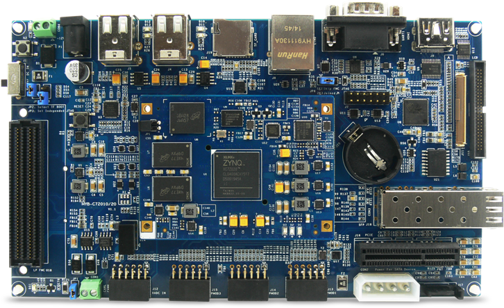

# FPGA Boards

## Boards and supported features

<table>
    <tr>
        <th>Board</th>
        <th>SoC</th>
        <th>MIPI</th>
        <th>FMC</th>
        <th>Output</th>
        <th>Other</th>
    </tr>
    <tr>
        <td>
            

                <a herf="https://www.avnet.com/wps/portal/apac/products/products/xilinx-embedded-vision-development-kit-picozed-7030-som-based/">Picozed Zynq 7030 som + FMC carrier v2</a>
            

        </td>
        <td>
        Zynq7030
        </td>
        <td>
        </td>
        <td>
        LPC
        </td>
        <td>
        </td>
        <td>
        </td>
    </tr>
    <tr>
        <td>
            

                <a herf="http://www.myir-tech.com/product/myd_C7Z010_20.htm">MYD-C7Z020</a>
            

        </td>
        <td>
        Zynq7020
        </td>
        <td>
        </td>
        <td>
        LPC
        </td>
        <td>
        HDMI
        </td>
        <td>
        </td>
    </tr>
    <tr>
        <td>
            

                <a herf="">ZYNQ_DEV</a>
            

        </td>
        <td>
        Zynq7020
        </td>
        <td>
        RPi 15P
        </td>
        <td>
        LPC
        </td>
        <td>
        HDMIx2
        </td>
        <td>
        </td>
    </tr>
    <tr>
        <td>
            

                <a herf="https://www.amd.com/en/products/adaptive-socs-and-fpgas/evaluation-boards/zcu104.html">AMD Zynq™ UltraScale+™ MPSoC ZCU104 Evaluation Kit</a>
            

        </td>
        <td>
        ZU7EV
        </td>
        <td>
        </td>
        <td>
        LPC
        </td>
        <td>
        HDMI in, HDMI out, DisplayPort
        </td>
        <td>
        </td>
    </tr>
    <tr>
        <td>
            

                <a herf="https://www.amd.com/en/products/system-on-modules/kria/k26/kv260-vision-starter-kit.html">Kria KV260 Vision AI Starter Kit</a>
            

        </td>
        <td>
        Kria K26
        </td>
        <td>
        RPi 15P
        </td>
        <td>
        </td>
        <td>
        DisplayPort(PS) 
        HDMI(DP splited)
        </td>
        <td>
        IAS1: AR1330+AR1302  
        IAS2:
        </td>
    </tr>
    <tr>
        <td>
            

                <a herf="https://www.enclustra.com/en/products/base-boards/mercury-st1/">Enclustra Mercury+ ST1</a>
                <a herf="https://www.enclustra.com/en/products/system-on-chip-modules/mercury-xu6/">Enclustra Mercury+ XU6</a>
            

        </td>
        <td>
        ZU2CG
        </td>
        <td>
        RPi 15P * 2
        </td>
        <td>
        HPC
        </td>
        <td>
        HDMI out(redriver) DisplayPort(PS, miniDP)
        </td>
        <td>
        </td>
    </tr>
</table>

## ZynqMP Ultrascale+

### Kria KV260 Vision AI Starter Kit
[Link](https://www.amd.com/en/products/system-on-modules/kria/k26/kv260-vision-starter-kit.html)

    

### Mercury+ ST1 + XU6
[Enclustra Mercury+ ST1](https://www.enclustra.com/en/products/base-boards/mercury-st1)

    

[Enclustra Mercury+ XU6](https://www.enclustra.com/en/products/system-on-chip-modules/mercury-xu6)

    

### ZCU104
[AMD Zynq™ UltraScale+™ MPSoC ZCU104 Evaluation Kit](https://www.amd.com/en/products/adaptive-socs-and-fpgas/evaluation-boards/zcu104.html)

    

## Zynq7000

### ZYNQ_DEV

      
      <a herf="">ZYNQ_DEV</a>

### MYD-C7Z020
[Link](http://www.myir-tech.com/product/myd_C7Z010_20.htm)

      

### Picozed Zynq 7030 som + FMC carrier v2
[Link](https://www.avnet.com/wps/portal/apac/products/products/xilinx-embedded-vision-development-kit-picozed-7030-som-based)

    

