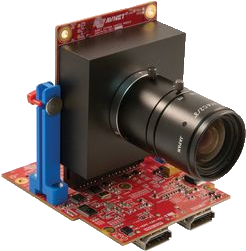
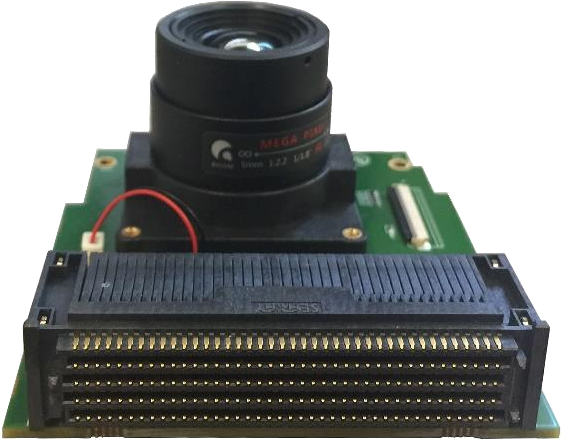
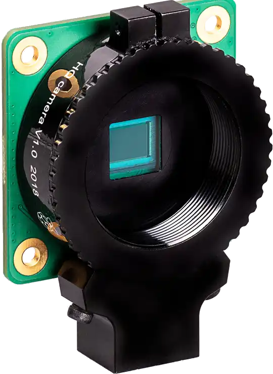
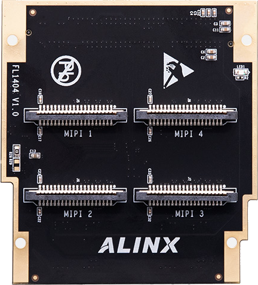
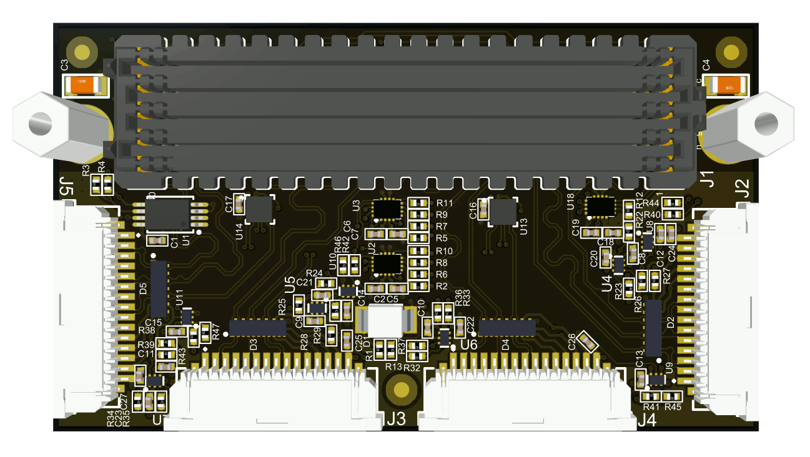

# Camera modules and adaptors

## Camera modules

<table>
    <th>
        Camera Module
    </th>
    <th>
        Features
    </th>
<tr>
    <td>
        

            
        

        

            <a herf="https://www.avnet.com/shop/us/products/avnet-engineering-services/aes-cam-on-p1300c-g-3074457345635221618/">AES-CAM-ON-P1300C-G</a> + <a herf="https://www.avnet.com/shop/us/products/avnet-engineering-services/aes-fmc-hdmi-cam-g-3074457345635221625/">AES-FMC-HDMI-CAM-G</a>
        

    </td>
    <td>
        
Sensor: Onsemi PYTHON1300 

        
Features: 

        
1/2 CMOS, Bayer RAW10, Pipelined Global Shutter, 2/4 lane LVDS, 4.8um 

        
Active: 1280(H)x1024s(V) 1.31M 

        
Module: 

        
FMC LPC 

        
HDMI in(ADV7611) 

        
HDMI out(ADV7511) 

    </td>
</tr>
<tr>
    <td>
        

            
        

            <a herf="https://leopardimaging.com/product/csi-2-mipi-modules-i-pex/li-imx274mipi-fmc/">LI-IMX274-FMC</a>
        

    </td>
    <td>
        
Sensor: SONY IMX274 

        
Features: 

        
1/1.25 CMOS, Bayer RAW10/12, 4 lane MIPI-CSI, 1.62um 

        
Total: 3864(H)×2218(V) 8.57M 

        
Effective: 3864(H)x2202(V) 8.51M 

        
Active: 3864(H)x2196(V) 8.49M 

        
Recommanded: 3840(H)x2160(V) 8.29M 

        
Module: 

        
FMC LPC 

    </td>
</tr>
<tr>
    <td>
        

            
        

        

            IMX219 Module Raspberry Pi 15 pin compatible
        

    </td>
    <td>
        
Sensor: SONY IMX219 

        
Features: 

        
1/4 CMOS, Bayer RAW10, 2/4 lane MIPI-CSI, 1.12um 

        
Total: 3296(H)×2512(V) 8.28M 

        
Effective: 3296(H)x2480(V) 8.17M 

        
Active: 3280(H)x2464(V) 8.08M 

        
Module: 

        
RaspberryPi 15pin interface 

    </td>
</tr>
<tr>
    <td>
        

            
        

        

            Raspberry Pi HQ Camera Module
        

    </td>
    <td>
        
Sensor: SONY IMX477 

        
Features: 

        
1/2.3 CMOS, Bayer RAW12/10/8, 2/4 lane MIPI-CSI, 1.55um 

        
Total: 4072(H)×3176(V) 12.93 

        
Effective: 4072(H)x3064(V) 12.47M 

        
Active: 4056(H)x3040(V) 12.33M 

        
Module: 

        
RaspberryPi 15pin interface 

    </td>
</tr>
</table>

## Camera adaptors

<table>
<tr>
    <th>Board</th>
    <th>Description</th>
</tr>
<tr>
    <td>
        

            
        

        

            ALINX FL1404
        

    </td>
    <td>MIPI CSI*4, 20Pin 1mm, LPC</td>
</tr>
<tr>
    <td>
        

            
        

        

            Opsero RPi Camera FMC
        

    </td>
    <td>RPi 15P*4, LPC</td>
</tr>
</table>

