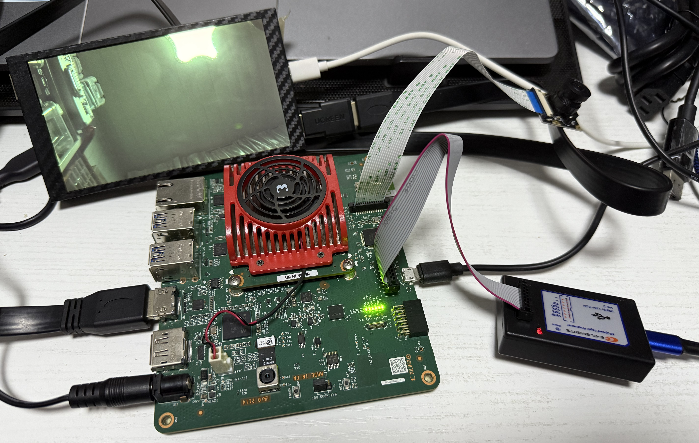

#KV260 Projects

##Board

[Kria KV260 Vision Kit](Boards.md###Kria-KV260-Vision-Kit)


##IMX219

###Camera module

###Build and run

Copied for Greg Taylor's project, and update to **2024.2**.
Tested Raspberry Pi Camera module V2(IMX219) & Raspberry Pi Camera HQ (IMX477)

```shell
source $(VITIS_PATH)/settings64.sh
make BOARDS=kv260 INPUT_PORTS=mipi0 OUTPUT_PORTS=ps_dp
```

Since KV260 fw bootloader is not compatible with standalone BOOT.BIN. So we need a Jtag to run the demo. Need to set KV260 to jtag boot mode:

```shell
source $(VITIS_PATH)/settings64.sh
xsct scripts/som_bootmode.tcl
```

after that use Vitis to open the sw workspace and run the demo.

<p align="center">

</p>
