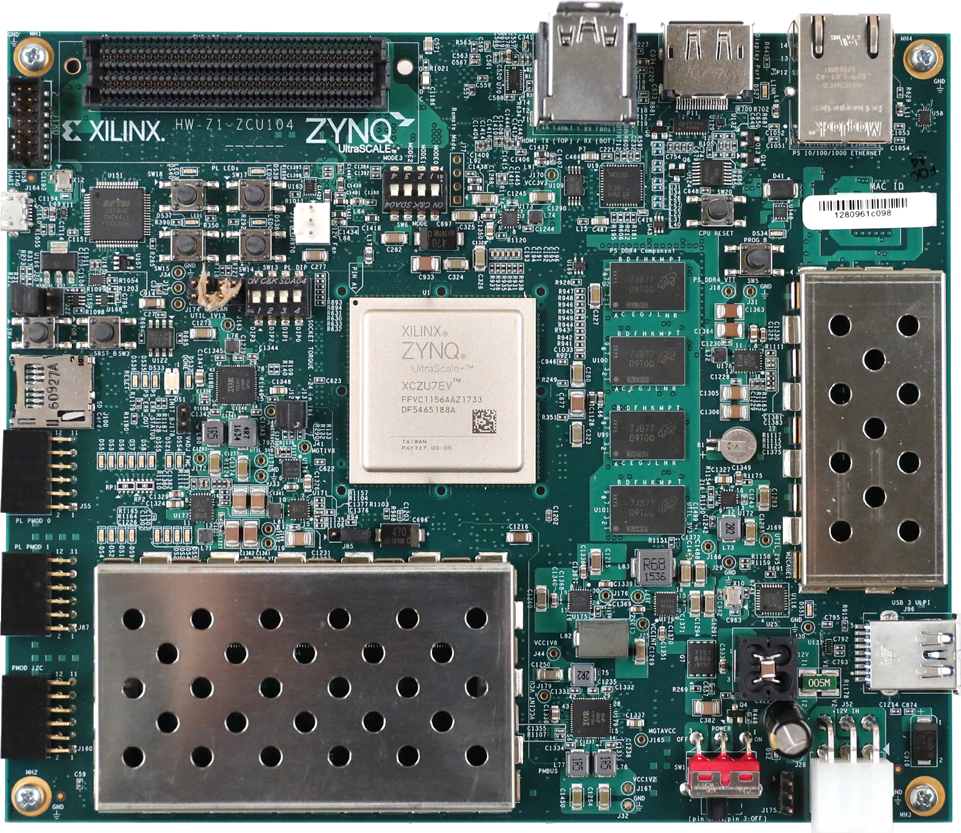

#LI-IMX274-FMC + ZCU104
##Board
<p align="center">
    
    <a herf="https://www.amd.com/en/products/adaptive-socs-and-fpgas/evaluation-boards/zcu104.html">AMD Zynq™ UltraScale+™ MPSoC ZCU104 Evaluation Kit</a>
</p>

##Camera

##Project

This project is porting from ZCU106 VCU TRD reference design.
updated to 2024.2

```shell
cd scripts
vivado -mode tcl -source zcu104_vcu_trd_proj.tcl -notrace
```
