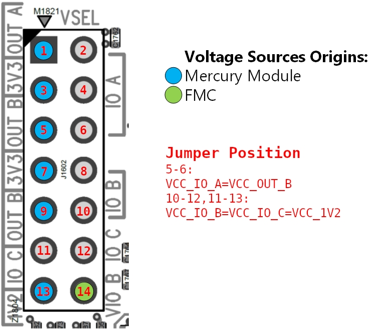

#Mercury+ ST1 + XU6

##Board
[Mercury+ ST1 + XU6](Boards.md######Mercury+-ST1-+-XU6)

##Onboard RPi Camera

```shell
source $(VITIS_PATH)/settings64.sh
# build MIPI0
make BOARDS=me_st1_xu6_2cg INPUT_PORTS=MIPI0 OUTPUT_PORTS=ps_dp
# build MIPI1
make BOARDS=me_st1_xu6_2cg INPUT_PORTS=MIPI1 OUTPUT_PORTS=ps_dp
```

imx219 module tested, video out 1080p at 60fps.

<p align="center">

</p>

##Opsero RPi Camera FMC

###Design Settings

Opsero RPi Camera FMC adapter have 4 RPI 15 pin mipi camera ports, only port 1 with CLK_SEL=0 and port 2 could be used on Mercury+ ST1 with XU6 2CG.
|MIPI|Bank|FPGA PIN|Clock SEL|
|----|----|--------|---------|
|MIPI0|65|-|-|
|MIPI1|65|CLK(L7/L6) D0(L1/K1) D1(J1/H1)|CAM1_CLK_SEL=0|
|MIPI2|66|CLK(D7/D6) D0(C8/B8) D1(E5/D5)|-|
|MIPI3|66|-|-|

For MIPI2, since Xilinx MIPI CSI RX subsystem using BIT_SLICE resource and MIPI2 signals are not in same byte group, generated bg_* ports should be connected to the pin which defined in the generated xdc file [link](https://adaptivesupport.amd.com/s/question/0D54U00006hw47QSAQ/place-30687-error-when-using-the-mipi-rx-subsystem-on-zcu102-evaluation-board?language=zh_CN).

According to [opsero detail description](https://camerafmc.com/docs/rpi-camera-fmc/detailed-description/), use 2bit constans(0x3) set IO dir as output and 2bit constans(0x2) to set IO0 output enabled, IO1 Hi-Z.

|Net name|FMC Pin|Purpose|
|--------|-------|-------|
|CAM_IO0_DIR|LA13_P|IO0 direction (0=Cam-to-FPGA,1=FPGA-to-cam)|
CAM_IO1_DIR|LA13_N|IO1direction (0=Cam-to-FPGA,1=FPGA-to-cam)|
|CAM_IO0_OE_N|LA27_P|IO0 output enable (0=Enabled,1=Hi-Z output)|
|CAM_IO1_OE_N|LA27_N|IO1 output enable (0=Enabled,1=Hi-Z output)|

###Board Settings
According to Opsero documents, it is recommended to set FMC VAD_J as 1.2V. Connect jumper 5-6: VCC_IO_A=VCC_OUT_B; 10-12,11-13: VCC_IO_B=VCC_IO_C=VCC_1V2.

<p align="center">

</p>

###Build and run

At top dir, run

```shell
source $(VITIS_PATH)/settings64.sh
make BOARDS=me_st1_xu6_2cg FMC_BOARDS=opsero INPUT_PORTS=fmc_mipi1 OUTPUT_PORTS=ps_dp
```
default project using MIPI port 1, you can specify using MIPI2.
At top dir
```shell
make BOARDS=me_st1_xu6_2cg FMC_BOARDS=opsero INPUT_PORTS=fmc_mipi2 OUTPUT_PORTS=ps_dp
```
Default build is debug build, you can use BUILD=Release change to release build for Vitis bsp and apps.
imx219 module tested, video out 1080p at 60fps.

<p align="center">

</p>
