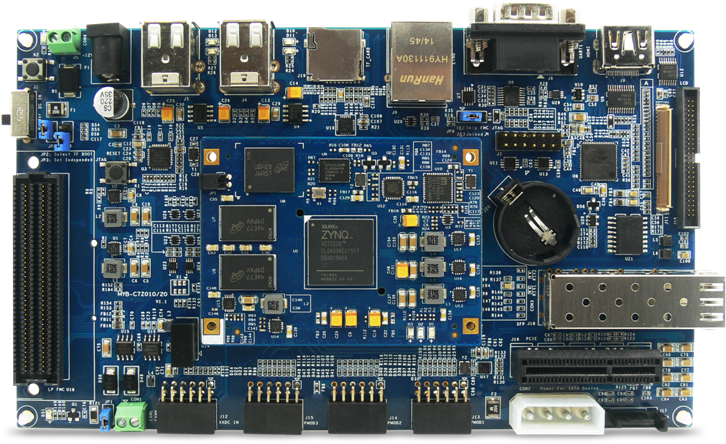
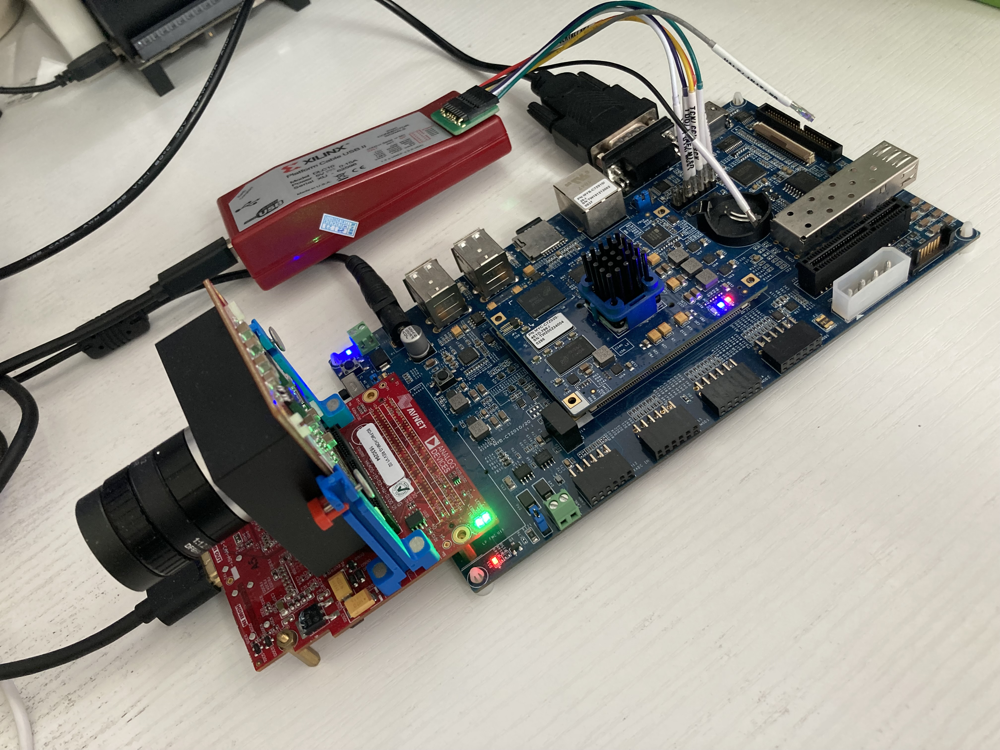

#PYTHON1300 FMC + MYD-C7Z020

##Board
<p align="center">
      
      <a herf="http://www.myir-tech.com/product/myd_C7Z010_20.htm">MYD-C7Z020</a>
</p>

##Camera

##Project

This project is now updated to **2024.2**.
   * combined color space convert and chroma subsampling into single Video Processing Subsystem IP;
   * replace OSD with Video Mixer IP;
   * add one more test pattern generated base layer.

```shell
source $(VITIS_PATH)/settings64.sh
make fmchc_python1300c_myir7020
```

<p align="center">

</p>
