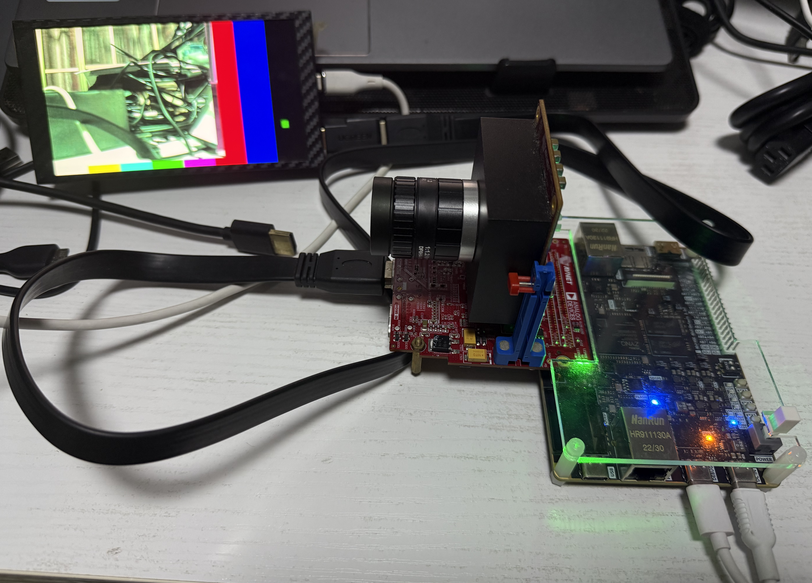

#PYTHON1300 FMC + ZYNQ_DEV

This project is now updated to **2024.2**.
   * combined color space convert and chroma subsampling into single Video Processing Subsystem IP;
   * replace OSD with Video Mixer IP;
   * add one more test pattern generated base layer.

```shell
source $(VITIS_PATH)/settings64.sh
make zynqdev_fmchc_python1300c
```

<p align="center">

</p>
